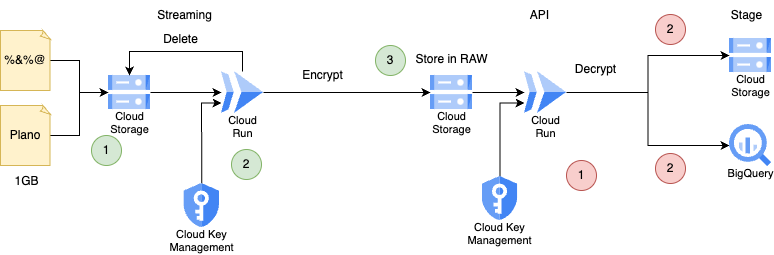

# This is not an official Google project.

This script is for **educational purposes only**, is **not certified** and is **not recommended** for production environments.

## Copyright 2021 Google LLC

 Licensed under the Apache License, Version 2.0 (the "License");
 you may not use this file except in compliance with the License.
 You may obtain a copy of the License at

      http://www.apache.org/licenses/LICENSE-2.0

 Unless required by applicable law or agreed to in writing, software
 distributed under the License is distributed on an "AS IS" BASIS,
 WITHOUT WARRANTIES OR CONDITIONS OF ANY KIND, either express or implied.
 See the License for the specific language governing permissions and
 limitations under the License.
# Theory



Python library for large file encription
* [Fernet](https://cryptography.io/en/latest/fernet/)

Python examples to interact with Google Cloud Storage
* [Read Write to Cloud Storage](https://cloud.google.com/appengine/docs/legacy/standard/python/googlecloudstorageclient/read-write-to-cloud-storage)

Event Notification in Google Cloud Storage
* [Create Commands](https://cloud.google.com/sdk/gcloud/reference/storage/buckets/notifications/create)

Python example of a Pub/Sub PUSH Subscriber 
* [pubsub-push](https://cloud.google.com/run/docs/triggering/pubsub-push)


# Setup

```sh
export PROJECT_ID= 
```

```sh
gcloud iam service-accounts create trigger-pubsub \
   --display-name "trigger-pubsub"

gcloud run services add-iam-policy-binding encryption \
   --member=serviceAccount:trigger-pubsub@$PROJECT_ID.iam.gserviceaccount.com \
   --role=roles/run.invoker --region southamerica-west1

gcloud pubsub topics create new-file

gsutil mb -l southamerica-west1 gs://encryption-storage

gcloud storage buckets notifications create --event-types=OBJECT_FINALIZE gs://encryption-storage --topic=new-file

```

# Deploy

First of all, create a key to encrytpt the content
This method will create a Fernet symmetric key and then will encrypt it with Cloud KMS

```sh
python tk.py CreateKey
```

Copy that key and set all env variables before to run the next command

```sh
cat > .env << ENDOFFILE
PROJECT_ID=""
LOCATION_ID=""
KEY_RING_ID=""
KEY_ID=""
ENCRYPTED_KEY=""
DESTINATION_BUCKET=""
ENDOFFILE

./deploy.sh 1
```

Copy cloud run url and set the CLOUD_RUN_URL env var before run the next command.

```sh
export CLOUD_RUN_URL=

gcloud pubsub subscriptions create new-file-subscription --topic new-file \
   --ack-deadline=600 \
   --push-endpoint=$CLOUD_RUN_URL \
   --push-auth-service-account=trigger-pubsub@$PROJECT_ID.iam.gserviceaccount.com
```

